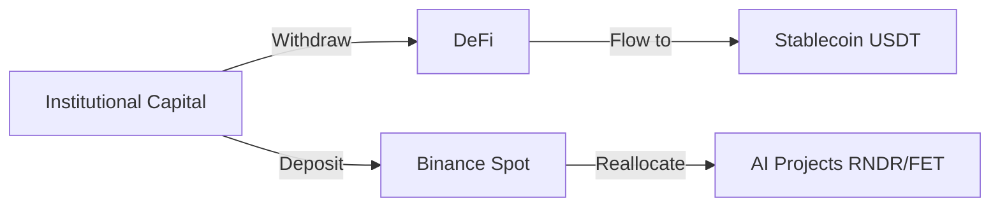

## Introduction: Multiple Drivers Behind the Downturn  

On **March 22 2024**, Binance data showed **Bitcoin (BTC) falling to $68,680 (‑2.81 %)** and **Ethereum (ETH) dropping to $2,082 (‑3.51 %)**, with a **2 %–4 % pull‑back across multiple chains**. At first glance it looks like a pure technical correction, but in reality it reflects the intersecting influence of **macroeconomics, risk appetite, on‑chain activity, and AI‑sector fund flows**. This article dissects the current market from macro to micro, technical to fundamental, and offers actionable investment advice.  

---  

## 1️⃣ Market Overview: Dual Push from Macro and On‑Chain  

### 1.1 Macro‑Economic Environment  

- **Fed Rate‑Hike Expectations**: Recent U.S. inflation data remain above forecasts, prompting markets to anticipate another 25‑bp Fed hike this quarter. This lifts the USD index and depresses demand for risk assets.  
- **Geopolitical Uncertainty**: European energy crises and strained Asian supply chains push institutional investors toward safe‑haven assets, prompting sales of high‑volatility crypto.  

### 1.2 On‑Chain Activity  

| Asset | 24h Active Addresses | 24h On‑Chain Volume (USD) | Note |
|-------|----------------------|---------------------------|------|
| **BTC** | 1.2 M | $3.9 B | Slight decline |
| **ETH** | 1.0 M | $4.4 B | 8 % down from last week |
| **BNB** | 210 K | $0.9 B | Stable |
| **SOL** | 160 K | $0.6 B | Affected by DeFi outflows |
| **AVAX**| 45 K  | $0.2 B | Clear outflow |

> **Key Insight**: A sustained drop in active addresses often precedes price declines and signals early weakening sentiment. Watch address metrics to gauge entry/exit timing.  

### 1.3 Fund Flows  

- **Binance Net Inflows**: As of 03:00 UTC, Binance accounts saw a net inflow of ~**$1.2 B**, indicating that some institutions are still positioning on the dip.  
- **DeFi Outflows**: Total Value Locked (TVL) in DeFi fell to **$31 B**, a 5 % drop week‑over‑week, suggesting diminishing allure of high‑yield projects.  

---  

## 2️⃣ Technical Analysis of Major Coins  

### 2.1 BTC (**$68,680**)  

- **Daily Candles**: BTC is forming a continuation pattern within an ascending channel, currently trading between **$68,228.50 (low)** and **$71,100.94 (high)**.  
- **Critical Support**: $68,000 (psychological round number) → $66,500 (previous low)  
- **Resistance**: $71,200 (high of the upper wick) → $73,000 (previous high)  

> If BTC breaks below $68,000, short‑term pressure may push it toward the $66,500 zone. Holding above that level keeps the rebound possibility near $71,200.  

### 2.2 ETH (**$2,082**)  

- **Daily Shape**: A descending triangle has developed over the past two weeks, with the close approaching the lower trend line.  
- **Support**: $2,050 (daily low) → $2,020 (previous low)  
- **Resistance**: $2,168 (peak) → $2,200 (key retracement level)  

> ETH’s decline is slightly steeper than BTC’s. A break below $2,020 could open a path toward the $1,950 region.  

### 2.3 Other Major Chains  

| Asset | Current Price | 24h Change | Key Support | Key Resistance |
|-------|---------------|------------|-------------|-----------------|
| **BNB** | $630 | -1.93 % | $620 | $650 |
| **SOL** | $87.28 | -3.24 % | $85 | $90 |
| **ADA** | $0.2555 | -3.40 % | $0.24 | $0.28 |
| **AVAX**| $9.12 | -4.30 % | $8.80 | $9.70 |

---  

## 3️⃣ Niche Chains & AI Hotspots: Opportunities Amid the Downturn  

### 3.1 AI Sector Snapshot  

| Project | Current Price | 24h Change | Comment |
|---------|---------------|------------|---------|
| **Render (RNDR)** | $1.64 | -3.54 % | Recent compute‑power partnership with a major film studio; long‑term demand looks solid. |
| **Fetch.ai (FET)** | $0.2173 | -1.76 % | On‑chain activity stays around $13 M volume; growth of AI data markets underpins demand. |

### 3.2 Performance of Selected Niche Chains  

| Project | Current Price | 24h Change | Recent News |
|---------|---------------|------------|-------------|
| **RNDR** | $1.64 | -3.54 % | Partnership with Epic Games |
| **FET**  | $0.2173 | -1.76 % | Completed a new financing round |
| **NEAR** | $1.29 | -1.75 % | Successful mainnet upgrade |
| **TAO**  | $268  | -1.40 % | Integrated with an AI compute platform |

> **Investment View**: AI‑related chains have shown milder declines than the broader market. If capital continues to rotate from high‑risk meme tokens to structurally sound projects, RNDR and FET could exhibit **relative strength**.  

---  

## 4️⃣ Market Sentiment & Capital Flow Analysis  

### 4.1 VIX & Crypto Fear & Greed Index  

- **VIX**: Stood at **22.5** as of 03:00 UTC, indicating medium‑high volatility in traditional markets.  
- **Crypto Fear & Greed Index**: Fell to **38 (Fear)**, down from last week’s 44, reflecting a more pessimistic crypto sentiment.  

### 4.2 Whale Movements  

- **BTC Whales**: Approximately **0.8 %** of BTC moved to cold wallets in the past 24 h, suggesting some institutions are on the sidelines.  
- **ETH Whales**: About **1.2 %** shifted to cold storage, a slightly higher outflow rate than BTC.  

### 4.3 Capital Flow Diagram (Illustrative)  

> **Takeaway**: Money is moving from high‑risk DeFi to more stable spot exchanges and then into AI projects, creating a structural shift in the current rally.  

---  

## 5️⃣ Investor Action Plan & Risk Warnings  

### 5️⃣ Short‑Term Tactics  

1. **Staggered Entry**: Allocate **30 %** of intended BTC exposure if price dips below the $68,000 support; add another **20 %** if it breaks through $66,500.  
2. **Take‑Profit Levels**: Set a **20 %** profit target around $71,200; consider scaling out further if price reaches $73,000.  
3. **Hedging**: Use BTC/USDT perpetual short contracts to hedge spot exposure.  

### 5️⃣ Medium‑Long‑Term Positioning  

- **Core Holdings**: Keep BTC and ETH at **≥ 50 %** of the crypto portfolio to mitigate volatility erosion.  
- **Structural Add‑On**: Allocate **10 %–15 %** to AI‑sector tokens (RNDR, FET) or foundational infrastructure projects (NEAR, DOT) to capture long‑term growth.  
- **Dollar‑Cost Averaging (DCA)**: Invest a fixed amount (e.g., **$500**) weekly to smooth entry price and reduce timing risk.  

### 5️⃣ Risk Caveats  

- **Macro Policy Shock**: An unexpectedly aggressive Fed hike could trigger larger capital outflows.  
- **On‑Chain Technical Risk**: Many AI projects are still early‑stage; technical execution and commercial adoption remain uncertain.  
- **Regulatory Landscape**: Growing global regulatory scrutiny (e.g., SEC’s review of crypto derivatives) may temporarily pressure exchange liquidity.  

> **Conclusion**: While this correction shows clear selling pressure, the backdrop of easing macro risk, recovering on‑chain activity, and capital migration toward AI projects creates structural buying opportunities. Investors should practice disciplined position sizing, blend technical support‑resistance analysis with fundamental trends, and employ staggered entries and hedging tools to limit downside exposure. Wishing you a steady journey through the market’s waves.
