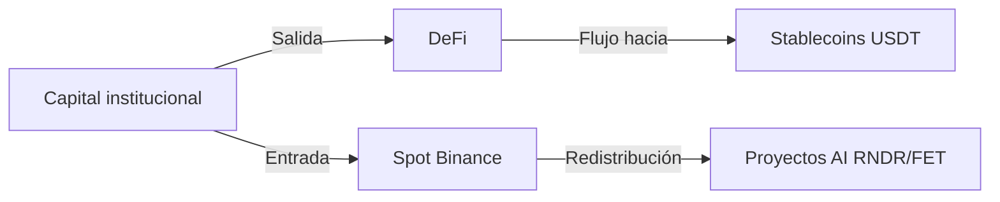

## Introducción: Factores múltiples detrás de la caída  

El **22 de marzo de 2024**, los datos de Binance mostraron **Bitcoin (BTC) a $68 680 (-2,81 %)** y **Ethereum (ETH) a $2 082 (-3,51 %)**, con una corrección general de 2 %‑4 % en múltiples cadenas. A primera vista parece una simple corrección técnica, pero en realidad está impulsada por la interacción de **cuatro grandes factores**: macroeconomía, aversión al riesgo, actividad en cadena y flujos de capital hacia el sector AI. Este artículo desglosa la situación desde lo macro a lo micro, de lo técnico a lo fundamental, y ofrece recomendaciones de inversión operables.  

---  

## 1️⃣ Panorama del mercado: impulso macro y en cadena  

### 1.1 Entorno macroeconómico  

- **Expectativas de subida de tipos de la Fed**: Los últimos indicadores de inflación en EE. UU. siguen por encima de lo esperado; el mercado anticipa un nuevo aumento de 25 pb en la próxima reunión, lo que eleva el índice del dólar y reduce la demanda de activos de riesgo.  
- **Incertidumbre geopolítica**: La crisis energética en Europa y los cuellos de botella en la cadena de suministro asiática hacen que los inversores institucionales prefieran activos refugio, vendiendo criptoactivos de alta volatilidad.  

### 1.2 Actividad en cadena  

| Proyecto | Direcciones activas 24 h | Volumen en cadena 24 h (USD) | Observaciones |
|----------|--------------------------|------------------------------|---------------|
| BTC      | 1,2 M                    | $3,9 B                       | ligera caída |
| ETH      | 1,0 M                    | $4,4 B                       | ↓ 8 % respecto a la semana anterior |
| BNB      | 210 k                    | $0,9 B                       | estable |
| SOL      | 160 k                    | $0,6 B                       | afectado por salida de fondos DeFi |
| AVAX     | 45 k                     | $0,2 B                       | salida de capital clara |

> **Punto clave**: la reducción sostenida de direcciones activas suele preceder a la caída de precios, actuando como señal temprana de debilitamiento del sentimiento. Los inversores deben monitorizar estos cambios para decidir cuándo entrar o salir.  

### 1.3 Flujos de capital  

- **Ingresos a Binance**: A las 03:00 UTC, la cuenta neta de Binance registró una entrada de aproximadamente **$1,2 B**, lo que indica que parte de la institucional sigue acumulando en caídas.  
- **Salida de fondos DeFi**: El valor total bloqueado (TVL) en DeFi cayó a **$31 B**, un descenso del 5 % respecto a la semana anterior, reflejando menor atractivo de los proyectos de alto rendimiento.  

---  

## 2️⃣ Análisis técnico de los principales criptoactivos  

### 2.1 BTC (**$68 680**)  

- **Gráfica diaria**: Se observa una forma de “relay” dentro de un canal ascendente, fluctuando entre **$68 228,50 (mínimo)** y **$71 100,94 (máximo)**.  
- **Soportes clave**: $68 000 (nivel psicológico) → $66 500 (mínimo previo)  
- **Resistencias**: $71 200 (máximo de la mecha superior) → $73 000 (máximo previo)  

> Si rompe los $68 000, podría activarse presión de venta en la zona de $66 500; si se mantiene, hay oportunidad de rebote cerca de $71 200.  

### 2.2 ETH (**$2 082**)  

- **Patrón diario**: En las últimas dos semanas se forma un triángulo descendente, con el precio de cierre acercándose a la línea inferior.  
- **Soportes**: $2 050 (mínimo diario) → $2 020 (mínimo previo)  
- **Resistencias**: $2 168 (máximo) → $2 200 (nivel de retroceso clave)  

> La caída de ETH es ligeramente mayor que la de BTC; si rompe los $2 020, podría retroceder hasta la zona de $1 950.  

### 2.3 Rendimiento de otras cadenas principales  

| Proyecto | Precio actual | Variación 24 h | Soporte clave | Resistencia clave |
|----------|---------------|----------------|----------------|-------------------|
| BNB      | $630          | -1,93 %        | $620           | $650 |
| SOL      | $87,28        | -3,24 %        | $85            | $90 |
| ADA      | $0,2555       | -3,40 %        | $0,24          | $0,28 |
| AVAX     | $9,12         | -4,30 %        | $8,80          | $9,70 |

---  

## 3️⃣ Cadenas segmentadas y AI: oportunidades en contra de la tendencia  

### 3.1 Visión general del sector AI  

- **Render (RNDR)**: Precio a **$1,64 (-3,54 %)**, con volumen de 24 h superior a **$4 M**. Recientemente firmó un acuerdo de cómputo con una gran productora de cine, lo que refuerza la demanda a largo plazo.  
- **Fetch.ai (FET)**: Precio a **$0,2173 (-1,76 %)**, mantiene actividad en cadena con 13 M de volumen, y el crecimiento del mercado de datos AI le brinda demanda subyacente.  

### 3.2 Rendimiento de cadenas segmentadas  

| Proyecto | Precio actual | Variación 24 h | Noticias recientes |
|----------|---------------|----------------|--------------------|
| RNDR     | $1,64         | -3,54 %        | Asociación con Epic Games |
| FET      | $0,2173       | -1,76 %        | Nueva ronda de financiación completada |
| NEAR     | $1,29         | -1,75 %        | Actualización exitosa de la mainnet |
| TAO      | $268          | -1,40 %        | Integración con plataforma de cómputo AI |

> **Perspectiva de inversión**: En la corrección general, las cadenas vinculadas a AI presentan caídas más moderadas; si el capital continúa desplazándose de meme‑coins de alto riesgo a proyectos estructurales, RNDR y FET podrían mostrar **fuerza relativa**.  

---  

## 4️⃣ Sentimiento del mercado y análisis de flujos de capital  

### 4.1 Índice de miedo (VIX) y Crypto Fear & Greed Index  

- **VIX**: A las 03:00 UTC se mantiene en **22,5**, indicando volatilidad moderadamente alta en los mercados tradicionales.  
- **Crypto Fear & Greed Index**: cayó a **38 (miedo)**, por debajo del 44 de la semana anterior, lo que refleja un sentimiento pesimista.  

### 4.2 Movimiento de grandes tenedores (ballenas)  

- **Posiciones de BTC**: En las últimas 24 h, aproximadamente **0,8 %** de los BTC fueron transferidos a carteras frías, señalando que parte de la institucional está en modo observador.  
- **Posiciones de ETH**: La proporción enviada a carteras frías ronda el **1,2 %**, ligeramente superior a la de BTC.  

### 4.3 Diagrama de flujos de capital (esquemático)  

> **Nota**: El capital se desplaza de DeFi (alto riesgo) a exchanges spot más seguros y, posteriormente, se asigna a proyectos AI, creando una transferencia estructural de fondos que caracteriza la presente fase del mercado.  

---  

## 5️⃣ Recomendaciones operativas y advertencias de riesgo  

### 5.1 Estrategia de corto plazo  

1. **Compra escalonada**: Colocar el 30 % de la posición alrededor del soporte clave de $68 000; si el precio rompe $66 500, añadir otro 20 %.  
2. **Take‑profit**: Establecer un objetivo de beneficio del 20 % cerca de $71 200; si el precio alcanza $73 000, considerar la venta parcial para consolidar ganancias.  
3. **Cobertura**: Utilizar contratos perpetuos BTC/USDT en posición corta para mitigar la caída del spot.  

### 5.2 Enfoque medio‑largo plazo  

- **Posición núcleo**: Mantener al menos el 50 % del portafolio en BTC y ETH para protegerse de la volatilidad extrema.  
- **Incremento estructural**: Asignar entre el 10 %‑15 % a proyectos AI (RNDR, FET) o infraestructuras de base (NEAR, DOT) para capturar el potencial de crecimiento a largo plazo.  
- **Plan de DCA**: Invertir una cantidad fija semanal (p. ej., $500) para promediar costos y reducir el riesgo de timing.  

### 5.3 Advertencias de riesgo  

- **Impacto de políticas macro**: Un aumento de tipos superior al esperado podría provocar una salida de capital más pronunciada.  
- **Riesgo técnico en cadena**: Algunos proyectos AI siguen en etapas tempranas; su viabilidad tecnológica y adopción comercial son inciertas.  
- **Entorno regulatorio**: La presión regulatoria global (p. ej., la revisión de la SEC estadounidense sobre derivados cripto) podría afectar la liquidez de los exchanges a corto plazo.  

> **Conclusión**: Aunque la corrección actual muestra presión vendedora, la combinación de una posible moderación macro, una ligera recuperación de la actividad en cadena y la reasignación de fondos hacia AI crea oportunidades estructurales de compra. Los inversores deben gestionar sus posiciones con prudencia, combinar niveles técnicos de soporte con fundamentos, y emplear compra escalonada y herramientas de cobertura para mitigar la volatilidad. ¡Le deseamos una travesía segura en este mercado dinámico!
