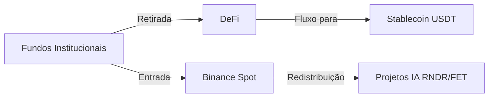

## Introdução: múltiplos fatores por trás da queda  

Em 22 de março de 2024, dados da Binance mostraram **Bitcoin (BTC) em US$68.680 (‑2,81 %)** e **Ethereum (ETH) em US$2.082 (‑3,51 %)**, com a maioria das cadeias registrando correções entre 2 % e 4 %. À primeira vista parece ser apenas uma correção técnica, mas na verdade envolve a intersecção de **macroeconomia, preferência de risco, atividade on‑chain e fluxo de fundos para o setor de IA**. Este artigo desmonta a movimentação de macro a micro, de técnica a fundamentals, e entrega recomendações operacionais.  

---  

## 1️⃣ Visão geral do mercado: impulso macro e on‑chain  

### 1.1 Ambiente macroeconômico  

- **Expectativas de alta de juros do Fed**: Dados recentes de inflação nos EUA ainda acima do esperado, levando o mercado a prever outro aumento de 25 pb nos juros neste trimestre, o que eleva o índice do dólar e reduz a demanda por ativos de risco.  
- **Incertezas geopolíticas**: Crise energética na Europa, tensões nas cadeias de suprimento na Ásia e outros fatores fazem investidores institucionais buscar ativos de refúgio, vendendo cripto‑ativos voláteis.  

### 1.2 Atividade on‑chain  

| Projeto | Endereços ativos (últimas 24 h) | Volume on‑chain 24 h (USD) | Observação |
|---------|-------------------------------|----------------------------|------------|
| BTC     | 1,2 M                         | $3,9 B                     | leve queda |
| ETH     | 1,0 M                         | $4,4 B                     | ↓ 8 % em relação à semana passada |
| BNB     | 210 k                         | $0,9 B                     | estável |
| SOL     | 160 k                         | $0,6 B                     | afetado por saída de fundos DeFi |
| AVAX    | 45 k                          | $0,2 B                     | saída de capital clara |

> **Ponto chave**: a queda contínua de endereços ativos costuma anteceder a queda de preço, servindo como sinal precoce de enfraquecimento do sentimento. Os investidores devem monitorar essa métrica para decidir entradas ou saídas.  

### 1.3 Fluxos de capital  

- **Entrada de fundos na Binance**: Até 03:00 UTC, a conta da Binance registrou fluxo líquido de aproximadamente **US$1,2 B**, indicando que algumas instituições ainda estão acumulando em baixa.  
- **Saída de fundos do DeFi**: O Valor Total Bloqueado (TVL) do DeFi recuou para **US$31 B**, 5 % abaixo da semana anterior, mostrando diminuição do apelo dos projetos de alto rendimento.  

---  

## 2️⃣ Análise técnica das principais moedas  

### 2.1 BTC (US$68.680)  

- **Candlestick diário**: Configuração de continuação dentro de um canal ascendente, atualmente variando entre **US$68.228,50 (mínimo)** e **US$71.100,94 (máximo)**.  
- **Suportes críticos**: US$68.000 (número psicológico) → US$66.500 (mínimo anterior)  
- **Resistências**: US$71.200 (ponto alto da sombra superior) → US$73.000 (máximo anterior)  

> Se romper abaixo de US$68.000, a pressão de venda pode atingir a zona de US$66.500; se mantiver, há chance de rebote próximo a US$71.200.  

### 2.2 ETH (US$2.082)  

- **Formação diária**: Triângulo descendente nos últimos 14 dias, com o preço de fechamento aproximando a linha inferior.  
- **Suportes**: US$2.050 (mínimo diário) → US$2.020 (mínimo anterior)  
- **Resistências**: US$2.168 (ponto alto) → US$2.200 (nível de correção chave)  

> O recuo do ETH é ligeiramente maior que o do BTC; caso quebre US$2.020, pode cair até a zona de US$1.950.  

### 2.3 Desempenho de outras cadeias principais  

| Projeto | Preço atual | Variação 24 h | Suporte crítico | Resistência crítica |
|---------|-------------|--------------|------------------|----------------------|
| BNB     | $630        | -1,93 %      | $620             | $650 |
| SOL     | $87,28      | -3,24 %      | $85              | $90 |
| ADA     | $0,2555     | -3,40 %      | $0,24            | $0,28 |
| AVAX    | $9,12       | -4,30 %      | $8,80            | $9,70 |

---  

## 3️⃣ Cadeias segmentadas e o hype de IA: oportunidades contra‑tendência  

### 3.1 Visão geral do setor de IA  

| Projeto | Preço | Variação 24 h | Comentário |
|---------|-------|--------------|------------|
| **Render (RNDR)** | $1,64 | -3,54 % | Volume diário ainda acima de $4 M. Recentemente assinou acordo de poder computacional com grande estúdio de cinema, demanda de longo prazo otimista. |
| **Fetch.ai (FET)** | $0,2173 | -1,76 % | Atividade on‑chain mantém 13 M em volume; crescimento do mercado de dados de IA sustenta a demanda subjacente. |

### 3.2 Desempenho de cadeias segmentadas  

| Projeto | Preço | Variação 24 h | Notícias recentes |
|---------|-------|--------------|--------------------|
| RENDER  | $1,64 | -3,54 % | Parceria com Epic Games |
| FET     | $0,2173 | -1,76 % | Nova rodada de financiamento concluída |
| NEAR    | $1,29 | -1,75 % | Upgrade bem‑sucedido da mainnet |
| TAO     | $268  | -1,40 % | Integração com plataforma de computação IA |

> **Perspectiva de investimento**: Na correção geral, os tokens ligados à IA tiveram quedas mais brandas. Caso os fundos migrem de meme‑coins de alto risco para projetos estruturais, RNDR e FET podem apresentar **força relativa**.  

---  

## 4️⃣ Sentimento de mercado e análise de fluxos de capital  

### 4.1 Índice de medo (VIX) e Crypto Fear & Greed Index  

- **VIX**: 22,5 às 03:00 UTC, indicando volatilidade moderadamente alta nos mercados tradicionais.  
- **Crypto Fear & Greed Index**: caiu para **38 (medo)**, abaixo dos 44 da semana passada, sinalizando pessimismo predominante.  

### 4.2 Movimento das baleias  

- **Posição de grandes detentores de BTC**: nas últimas 24 h, cerca de **0,8 %** dos BTC foram transferidos para cold wallets, indicando observação cautelosa por parte de instituições.  
- **Posição de grandes detentores de ETH**: proporção de 1,2 % movida para cold wallets, ligeiramente superior ao BTC.  

### 4.3 Diagrama de fluxos de capital (ilustração)  

> **Observação**: O capital está saindo dos projetos DeFi mais arriscados, indo para exchanges spot mais estáveis e, subsequentemente, sendo alocado em projetos de IA, configurando uma transferência estrutural de risco nesta rodada.  

---  

## 5️⃣ Recomendações operacionais e alertas de risco  

### 5.1 Estratégia de curto prazo  

1. **Compra em lotes**: alocar 30 % da posição desejada se o preço cair abaixo de **US$68.000** (suporte chave); caso rompa **US$66.500**, adicionar mais 20 %.  
2. **Take‑profit**: colocar ordem de venda parcial próximo a **US$71.200** (20 % do lote); se o preço subir para **US$73.000**, considerar realização progressiva de lucros.  
3. **Hedging**: usar contratos perpétuos BTC/USDT vendidos para proteger a posição spot contra quedas adicionais.  

### 5.2 Posicionamento de médio e longo prazo  

- **Posição núcleo**: manter BTC e ETH representando **≥ 50 %** da carteira para reduzir volatilidade geral.  
- **Aumento estrutural**: destinar **10 %–15 %** da alocação a projetos de IA (RNDR, FET) ou infraestrutura de camada base (NEAR, DOT) para capturar crescimento de longo prazo.  
- **Plano de DCA**: investir valor fixo semanal (ex.: US$500) para suavizar o preço médio e mitigar risco de timing.  

### 5.3 Alertas de risco  

- **Choque de política macro**: um aumento de juros maior que o esperado pode intensificar a saída de capital.  
- **Risco tecnológico**: projetos de IA ainda estão em fase inicial; a execução técnica e a adoção comercial são incertas.  
- **Regulamentação**: endurecimento regulatório global (ex.: revisão da SEC americana sobre derivativos cripto) pode impactar a liquidez das exchanges a curto prazo.  

> **Conclusão**: embora a correção atual apresente pressão vendedora, o cenário de diminuição de risco macro, recuperação da atividade on‑chain e fluxo de recursos para o setor de IA cria oportunidades de compra estruturada. Os investidores devem gerir o tamanho da posição com cautela, alinhar‑se aos níveis técnicos de suporte e fundamentos, e usar compras em lotes e ferramentas de hedge para limitar perdas em um mercado volátil. Boa jornada e que suas decisões sejam sempre bem fundamentadas.
