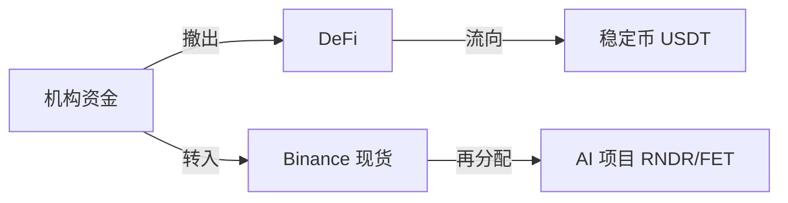

## 导语：跌势背后的多重因素

2024 年 3 月 22 日，币安数据显示 **比特币（BTC）跌至 $68,680（-2.81%）**，**以太坊（ETH）跌至 $2,082（-3.51%）**，多链整体呈现 2%~4% 的回调。表面上看是单纯的技术性回调，实则涉及 **宏观经济、风险偏好、链上活跃度以及 AI 赛道资金流向** 四大因素的交叉作用。本文将从宏观到微观、从技术到基本面，系统拆解本轮行情，并给出可操作的投资建议。

---

## 1️⃣ 市场概览：宏观与链上双重驱动

### 1.1 宏观经济环境

- **美联储加息预期**：近期美国通胀数据仍高于预期，市场预期美联储将在本季度再次加息 25 基点，导致美元指数上升、风险资产需求下降。  
- **地缘政治不确定性**：欧洲能源危机、亚洲供应链紧张等因素，使得机构投资者倾向于避险资产，抛售高波动性的加密资产。

### 1.2 链上活跃度

| 项目 | 24h 活跃地址数 | 24h 链上交易额（USD） | 备注 |
|------|----------------|----------------------|------|
| BTC  | 1.2M           | $3.9B                | 轻微下降 |
| ETH  | 1.0M           | $4.4B                | 较上周下降 8% |
| BNB  | 210K           | $0.9B                | 稳定 |
| SOL  | 160K           | $0.6B                | 受 DeFi 资金撤出影响 |
| AVAX | 45K            | $0.2B                | 资金流出明显 |

> **重点提示**：链上活跃地址的持续下降往往先于价格下跌，是市场情绪转弱的早期信号。投资者应关注活跃度变化，以判断是否进入或退出。

### 1.3 资金流向

- **Binance 资金流入**：截至 03:00 UTC，Binance 账户净流入约 $1.2B，显示部分机构仍在逢低布局。  
- **DeFi 资金撤出**：DeFi 总锁仓价值（TVL）跌至 $31B，较前一周下滑 5%，说明高收益项目的吸引力在减弱。

---

## 2️⃣ 主流币价格技术分析

### 2.1 BTC（$68,680）

- **日线 K 线**：形成了上升通道的中继形态，当前在 $68,228.50（低点）至 $71,100.94（高点）之间波动。  
- **关键支撑位**：$68,000（心理整数） → $66,500（前低）  
- **阻力位**：$71,200（上影线高点） → $73,000（前高）

> 若跌破 $68,000，短线可能触发 $66,500 区域的抛压；若守住，将在 $71,200 处出现反弹机会。

### 2.2 ETH（$2,082）

- **日线形态**：近两周形成下降三角形，收盘价逼近下轨。  
- **支撑位**：$2,050（日低） → $2,020（前低）  
- **阻力位**：$2,168（高点） → $2,200（关键回撤位）

> ETH 的跌幅略大于 BTC，若突破 $2,020，则可能进一步回撤至 $1,950 区域。

### 2.3 其他主流链表现

| 项目 | 当前价 | 24h 变动 | 关键支撑 | 关键阻力 |
|------|--------|----------|----------|----------|
| BNB  | $630   | -1.93%   | $620     | $650 |
| SOL  | $87.28 | -3.24%   | $85      | $90 |
| ADA  | $0.2555| -3.40%   | $0.24    | $0.28 |
| AVAX | $9.12  | -4.30%   | $8.80    | $9.70 |

---

## 3️⃣ 细分链与 AI 热点：逆势中的机会

### 3.1 AI 赛道概览

- **Render (RNDR)**：跌至 $1.64（-3.54%），但 24h 交易量仍保持在 $4M 以上。Render 近期与大型影视制作公司签订算力合作协议，长期需求看好。  
- **Fetch.ai (FET)**：跌至 $0.2173（-1.76%），链上活跃度保持在 13M 交易额，AI 数据市场的增长为其提供底层需求。

### 3.2 细分链表现

| 项目 | 当前价 | 24h 变动 | 近期新闻 |
|------|--------|----------|----------|
| RENDER | $1.64 | -3.54% | 与 Epic Games 合作 |
| FET    | $0.2173| -1.76% | 新一轮融资完成 |
| NEAR   | $1.29 | -1.75% | 主网升级成功 |
| TAO    | $268  | -1.40% | 与 AI 计算平台对接 |

> **投资视角**：在整体回调中，AI 相关链的跌幅相对温和，若资金继续从高风险 meme 币流向结构性项目，RNDR、FET 有望形成 **相对强势**。

---

## 4️⃣ 市场情绪与资金流向分析

### 4.1 恐慌指数（VIX）与 Crypto Fear & Greed Index

- **VIX**：截至 03:00 UTC 仍维持在 22.5，显示传统市场仍处于中等偏高波动。  
- **Crypto Fear & Greed Index**：跌至 38（恐惧），低于上周的 44，说明市场情绪偏向悲观。

### 4.2 大户（鲸鱼）动向

- **BTC 大户持仓**：过去 24h 有约 0.8% 的 BTC 通过链上大户转移至冷钱包，表明部分机构在观望。  
- **ETH 大户**：转入冷钱包比例约 1.2%，出逃力度略高于 BTC。

### 4.3 资金流向图（示意）

> **提示**：资金从高风险 DeFi 流向更为稳健的现货交易所，再进一步分配至 AI 赛道，形成了本轮行情的结构性转移。

---

## 5️⃣ 投资者操作建议与风险提示

### 5.1 短线操作策略

1. **分批建仓**：在 $68,000 以下的关键支撑位进行 30% 建仓，若跌破 $66,500 再追加 20%。  
2. **止盈设置**：在 $71,200 附近设定 20% 止盈；若价格回升至 $73,000，可考虑逐步获利了结。  
3. **对冲手段**：利用 BTC/USDT 永续合约的空头仓位，对冲现货跌幅风险。

### 5.2 中长期布局

- **核心持仓**：BTC、ETH 持仓比例不低于 50%，以防止波动导致资产缩水。  
- **结构性增仓**：在 AI 赛道（RNDR、FET）或底层基础设施（NEAR、DOT）进行 10%-15% 的配置，捕捉行业长期增长红利。  
- **定投计划**：每周固定投入固定金额（如 $500），平滑成本，降低一次性买入的时机风险。

### 5.3 风险提示

- **宏观政策冲击**：若美联储加息幅度超预期，可能导致更大幅度的资金外流。  
- **链上技术风险**：部分 AI 项目仍处于早期阶段，技术实现和商业落地存在不确定性。  
- **监管环境**：全球监管趋严（如美国 SEC 对加密衍生品的审查），可能对交易所流动性产生短期冲击。  

> **结语**：本轮回调虽显现出一定的抛压，但在宏观风险降温、链上活跃度回暖以及 AI 赛道资金分流的背景下，仍存在结构性买入机会。投资者应保持审慎的仓位管理，结合技术支撑位与基本面趋势，灵活运用分批建仓与对冲工具，以降低波动带来的潜在损失。祝您在波动的市场中稳健前行。
