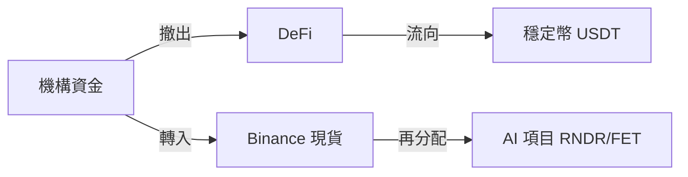

## 導語：跌勢背後的多重因素

2024 年 3 月 22 日，幣安數據顯示 **比特幣（BTC）跌至 $68,680（-2.81%）**，**以太坊（ETH）跌至 $2,082（-3.51%）**，多鏈整體呈現 2%~4% 的回調。表面上看是單純的技術性回調，實則涉及 **宏觀經濟、風險偏好、鏈上活躍度以及 AI 賽道資金流向** 四大因素的交叉作用。本文將從宏觀到微觀、從技術到基本面，系統拆解本輪行情，並給出可操作的投資建議。

---

## 1️⃣ 市場概覽：宏觀與鏈上雙重驅動

### 1.1 宏觀經濟環境

- **美聯儲加息預期**：近期美國通脹數據仍高於預期，市場預期美聯儲將在本季度再次加息 25 基點，導致美元指數上升、風險資產需求下降。  
- **地緣政治不確定性**：歐洲能源危機、亞洲供應鏈緊張等因素，使得機構投資者傾向於避險資產，拋售高波動性的加密資產。

### 1.2 鏈上活躍度

| 項目 | 24h 活躍地址數 | 24h 鏈上交易額（USD） | 備註 |
|------|----------------|----------------------|------|
| BTC  | 1.2M           | $3.9B                | 輕微下降 |
| ETH  | 1.0M           | $4.4B                | 較上週下降 8% |
| BNB  | 210K           | $0.9B                | 穩定 |
| SOL  | 160K           | $0.6B                | 受 DeFi 資金撤出影響 |
| AVAX | 45K            | $0.2B                | 資金流出明顯 |

> **重點提示**：鏈上活躍地址的持續下降往往先於價格下跌，是市場情緒轉弱的早期信號。投資者應關注活躍度變化，以判斷是否進入或退出。

### 1.3 資金流向

- **Binance 資金流入**：截至 03:00 UTC，Binance 帳戶淨流入約 $1.2B，顯示部分機構仍在逢低布局。  
- **DeFi 資金撤出**：DeFi 總鎖倉價值（TVL）跌至 $31B，較前一週下滑 5%，說明高收益項目的吸引力在減弱。

---

## 2️⃣ 主流幣價格技術分析

### 2.1 BTC（$68,680）

- **日線 K 線**：形成了上升通道的中繼形態，當前在 $68,228.50（低點）至 $71,100.94（高點）之間波動。  
- **關鍵支撐位**：$68,000（心理整數） → $66,500（前低）  
- **阻力位**：$71,200（上影線高點） → $73,000（前高）

> 若跌破 $68,000，短線可能觸發 $66,500 區域的拋壓；若守住，將在 $71,200 處出現反彈機會。

### 2.2 ETH（$2,082）

- **日線形態**：近兩週形成下降三角形，收盤價逼近下軌。  
- **支撐位**：$2,050（日低） → $2,020（前低）  
- **阻力位**：$2,168（高點） → $2,200（關鍵回撤位）

> ETH 的跌幅略大於 BTC，若突破 $2,020，則可能進一步回撤至 $1,950 區域。

### 2.3 其他主流鏈表現

| 項目 | 當前價 | 24h 變動 | 關鍵支撐 | 關鍵阻力 |
|------|--------|----------|----------|----------|
| BNB  | $630   | -1.93%   | $620     | $650 |
| SOL  | $87.28 | -3.24%   | $85      | $90 |
| ADA  | $0.2555| -3.40%   | $0.24    | $0.28 |
| AVAX | $9.12  | -4.30%   | $8.80    | $9.70 |

---

## 3️⃣ 細分鏈與 AI 熱點：逆勢中的機會

### 3.1 AI 賽道概覽

- **Render (RNDR)**：跌至 $1.64（-3.54%），但 24h 交易量仍保持在 $4M 以上。Render 近期與大型影視製作公司簽訂算力合作協議，長期需求看好。  
- **Fetch.ai (FET)**：跌至 $0.2173（-1.76%），鏈上活躍度保持在 13M 交易額，AI 數據市場的增長為其提供底層需求。

### 3.2 細分鏈表現

| 項目 | 當前價 | 24h 變動 | 近期新聞 |
|------|--------|----------|----------|
| RENDER | $1.64 | -3.54% | 與 Epic Games 合作 |
| FET    | $0.2173| -1.76% | 新一輪融資完成 |
| NEAR   | $1.29 | -1.75% | 主網升級成功 |
| TAO    | $268  | -1.40% | 與 AI 計算平台對接 |

> **投資視角**：在整體回調中，AI 相關鏈的跌幅相對溫和，若資金繼續從高風險 meme 幣流向結構性項目，RNDR、FET 有望形成 **相對強勢**。

---

## 4️⃣ 市場情緒與資金流向分析

### 4.1 恐慌指數（VIX）與 Crypto Fear & Greed Index

- **VIX**：截至 03:00 UTC 仍維持在 22.5，顯示傳統市場仍處於中等偏高波動。  
- **Crypto Fear & Greed Index**：跌至 38（恐懼），低於上週的 44，說明市場情緒偏向悲觀。

### 4.2 大戶（鯨魚）動向

- **BTC 大戶持倉**：過去 24h 有約 0.8% 的 BTC 透過鏈上大戶轉移至冷錢包，表明部分機構在觀望。  
- **ETH 大戶**：轉入冷錢包比例約 1.2%，出逃力度略高於 BTC。

### 4.3 資金流向圖（示意）

> **提示**：資金從高風險 DeFi 流向更為穩健的現貨交易所，再進一步分配至 AI 賽道，形成了本輪行情的結構性轉移。

---

## 5️⃣ 投資者操作建議與風險提示

### 5.1 短線操作策略

1. **分批建倉**：在 $68,000 以下的關鍵支撐位進行 30% 建倉，若跌破 $66,500 再追加 20%。  
2. **止盈設定**：在 $71,200 附近設定 20% 止盈；若價格回升至 $73,000，可考慮逐步獲利了結。  
3. **對沖手段**：利用 BTC/USDT 永續合約的空頭倉位，對沖現貨跌幅風險。

### 5.2 中長期布局

- **核心持倉**：BTC、ETH 持倉比例不低於 50%，以防止波動導致資產縮水。  
- **結構性增倉**：在 AI 賽道（RNDR、FET）或底層基礎設施（NEAR、DOT）進行 10%-15% 的配置，捕捉行業長期增長紅利。  
- **定投計畫**：每週固定投入固定金額（如 $500），平滑成本，降低一次性買入的時機風險。

### 5.3 風險提示

- **宏觀政策衝擊**：若美聯儲加息幅度超預期，可能導致更大幅度的資金外流。  
- **鏈上技術風險**：部分 AI 項目仍處於早期階段，技術實現和商業落地存在不確定性。  
- **監管環境**：全球監管趨嚴（如美國 SEC 對加密衍生品的審查），可能對交易所流動性產生短期衝擊。  

> **結語**：本輪回調雖顯現出一定的拋壓，但在宏觀風險降溫、鏈上活躍度回暖以及 AI 賽道資金分流的背景下，仍存在結構性買入機會。投資者應保持審慎的倉位管理，結合技術支撐位與基本面趨勢，靈活運用分批建倉與對沖工具，以降低波動帶來的潛在損失。祝您在波動的市場中穩健前行。
